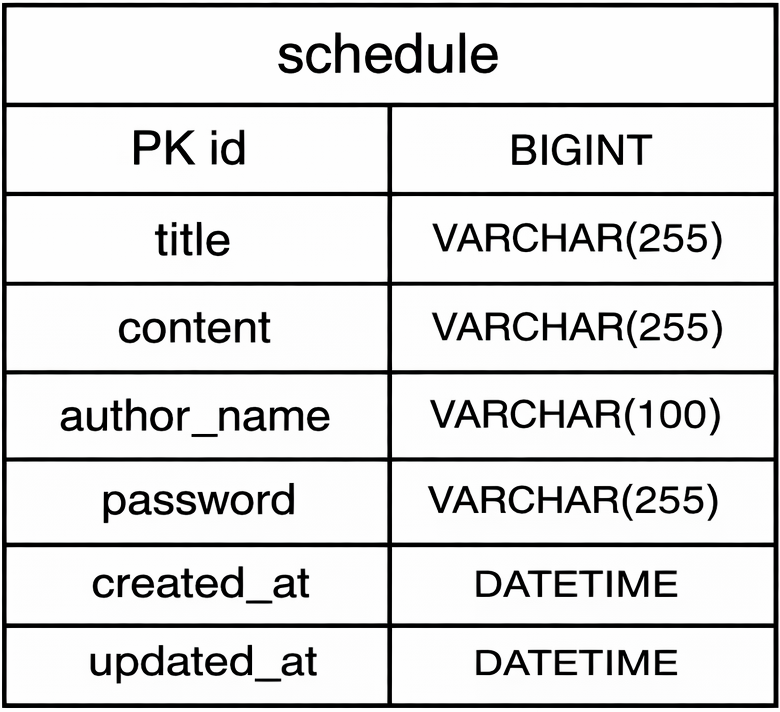

# CH.3 일정 관리 앱

---

## API 명세서 

### 1. 일정 생성
- Endpoint : `/schedules`
- Method : `POST`
- Parameters : 없음
- Status : `201 Created`
#### Request Body
```json
{
    "title" : "과제 제출",
    "content" : "스프링 과제 제출하기",
    "authorName" : "정예진",
    "password" : "1234"
}
```
#### Response
```json
{
    "id" : 1,
    "title" : "과제 제출",
    "content" : "스프링 과제 제출하기",
    "authorName" : "정예진",
    "createdAt" : "2026-04-09T22:00:00",
    "updatedAt" : "2026-04-09T22:00:00"
}
```
### 2. 전체 일정 조회
- Endpoint : `/schedules`
- Method : `GET`
- Parameters : 없음
- Status : `200 OK`
- #### Response
```json
[
  {
    "id" : 2,
    "title" : "팀 과제 희의",
    "content" : "오후 3시 회의 진행",
    "authorName" : "정예진",
    "createdAt" : "2026-04-09T23:00:00",
    "updatedAt" : "2026-04-09T23:00:00"
  },
  {
    "id" : 1,
    "title" : "과제 제출",
    "content" : "스프링 과제 제출하기",
    "authorName" : "정예진",
    "createdAt" : "2026-04-09T22:00:00",
    "updatedAt" : "2026-04-09T22:00:00"
  }
]
```
### 3. 선택 일정 조회
- Endpoint : `/schedules/{id}`
- Method : `GET`
- Parameters : `id`
- Status : `200 OK`
#### Response
```json
{
    "id" : 1,
    "title" : "과제 제출",
    "content" : "스프링 과제 제출하기",
    "authorName" : "정예진",
    "createdAt" : "2026-04-09T22:00:00",
    "updatedAt" : "2026-04-09T22:00:00"
}
```
### 4. 일정 수정
- Endpoint : `/schedules/{id}`
- Method : `PUT`
- Parameters : `id`
- Status : `200 OK`
#### Request Body
```json
{
    "title" : "과제 제출 수정",
    "authorName" : "정예진",
    "password" : "1234"
}
```
#### Response
```json
{
    "id" : 1,
    "title" : "과제 제출 수정",
    "content" : "스프링 과제 제출하기",
    "authorName" : "정예진",
    "createdAt" : "2026-04-09T22:00:00",
    "updatedAt" : "2026-04-10T15:00:00"
}
```
### 5. 일정 삭제
- Endpoint : `/schedules/{id}`
- Method : `DELETE`
- Parameters : `id`
- Status : `204 No Content`
#### Request Body
```json
{
    "password" : "1234"
}
```

---

## ERD


---


## 필수 기능

- [x] 일정 생성
  - `POST /schedules`
  - 제목, 내용, 작성자명, 비민번호를 입력받아 일정을 저장
  - `createdAt`, `updatedAt` 은 JPA Auditing을 사용
  - 응답 데이터에는 비밀번호를 포함하지 않았습니다.

- [x] 전체 일정 조회
  - `GET /schedules`
  - 작성자명이 입력되지 않으면 전체 일정을 조회
  - 작성자명이 입력되면 해당 작성자의 일정만 조회
  - 수정일(`updatedAt`) 기준 내림차순으로 정렬
  - 응답 데이터에는 비밀번호를 포함하지 않았습니다.
- [x] 선택 일정 조회
  - `GET /schedules/{scheduleId}`
  - 일정 ID를 기준으로 선택한 일정 1건을 조회
  - 응답 데이터에는 비밀번호를 포함하지 않았습니다.
- [x] 일정 수정
  - `PUT /schedules/{scheduleId}`
  - 일정 ID를 기준으로 제목과 작성자명을 수정
  - 비밀번호가 일치할 경우에만 수정 가능
  - `createdAt`은 유지되고, `updatedAt`은 수정 시점으로 변경
  - 응답 데이터에는 비밀번호를 포합하지 않았습니다.
- [x] 일정 삭제
  - `DELETE /schedules/{scheduleId}`
  - 일정 ID를 기준으로 선택한 일정을 삭제
  - 비밀번호가 일치할 경우에만 삭제 가능
